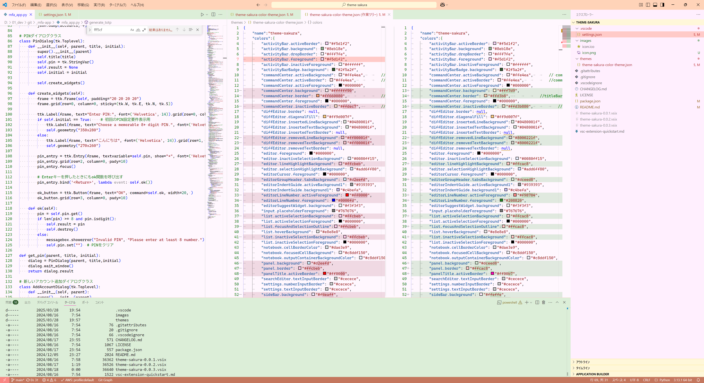

# Sakura Theme

Sakura Theme is a delicate color theme for Visual Studio Code inspired by cherry blossoms and flower gardens. It features soft pastel colors with warm undertones that reduce eye strain during long coding sessions.

## Features

- Soft pink background reminiscent of cherry blossom petals
- Warm accents with terracotta status bar and light yellow section headers
- Green activity bar representing stems and leaves
- Carefully balanced contrast for readability

## Screenshots

## Installation

1. Open VS Code
2. Click on the Extensions icon in the Activity Bar
3. Search for "Sakura Theme"
4. Click Install

## Usage

1. Open the VS Code Command Palette (Ctrl+Shift+P or Cmd+Shift+P)
2. Type "Preferences: Color Theme"
3. Select "Sakura Theme" from the list

## Feedback

If you encounter any issues or have suggestions for improvements, please report them in the [Issues section](https://github.com/mhiratani/theme-sakura/issues) of the GitHub repository.

## License

This project is released under the MIT License. See the [LICENSE](LICENSE) file for details.

---

# Sakura Theme

Sakura Themeは、桜と花園からインスピレーションを得たVisual Studio Code用の繊細なカラーテーマです。長時間のコーディングでも目の疲れを軽減する、柔らかなパステルカラーと暖かな色調を特徴としています。

## 特徴

- 桜の花びらを思わせる柔らかなピンク色の背景
- テラコッタ色のステータスバーと淡い黄色のセクションヘッダーによる暖かなアクセント
- 茎や葉をイメージした緑色のアクティビティバー
- 読みやすさを考慮した適切なコントラスト

## スクリーンショット

## インストール方法

1. VS Codeを開きます
2. アクティビティバーから拡張機能アイコンをクリックします
3. 検索バーに "Sakura Theme" と入力します
4. インストールをクリックします

## 使用方法

1. VS Codeのコマンドパレットを開きます（Ctrl+Shift+P または Cmd+Shift+P）
2. "Preferences: Color Theme" と入力します
3. リストから "Sakura Theme" を選択します

## フィードバック

問題や改善の提案がある場合は、GitHubリポジトリの[Issuesセクション](https://github.com/mhiratani/theme-sakura/issues)に報告してください。

## ライセンス

このプロジェクトはMITライセンスの下で公開されています。詳細は[LICENSE](LICENSE)ファイルを参照してください。